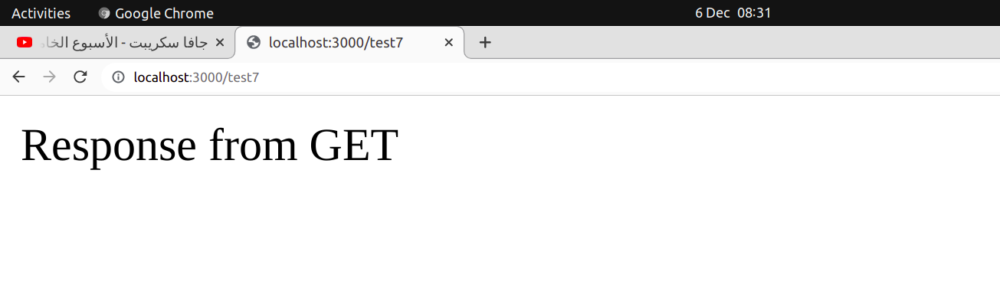

# Tuwaiq-JS
**Tuwaiq-Academey course of JavaScript programming language.**

## Nodejs
*Do the following:*
- install Node Js and verify if it's downloaded
```bash
sudo apt-get install nodejs
node --version
```
- try javascript code in Command Line Interface 

- create javascript file and write some programming commands within it.
- run the file using:
```bash
node app.js
```
- create another file called multi within function takes two numbers and returns the result of multiplication.
- export the function and import it
- use it in app.js file
---
*Do the following*

- Install Express and verify
```bash
npm install express
```
- create app.js
- write main commands to make express server
- create get function
- create listen function 
- run this server using Node JS
- try get function using google chrome
```javascript
const express = require('express');
const app = express();

app.get("/test", (req, res)=>{
	res.send("Get request and this is the response")
});

app.listen(3000, ()=>{
	console.log("Server is working")
});
```
## Homework

###### *Create app.js and revise these followings requests:*

1. ~~Install Node JS and verify if it's downloaded~~
1. ~~try javascript code in Command Line Interface~~
1. ~~Install Express and verify~~
1. write main commands to make express server.
1. create get function on /test7 and make the response be "Response from GET"
1. create listen function
1. run this server using Node JS
1. try get function using google chrome

*GET response*
