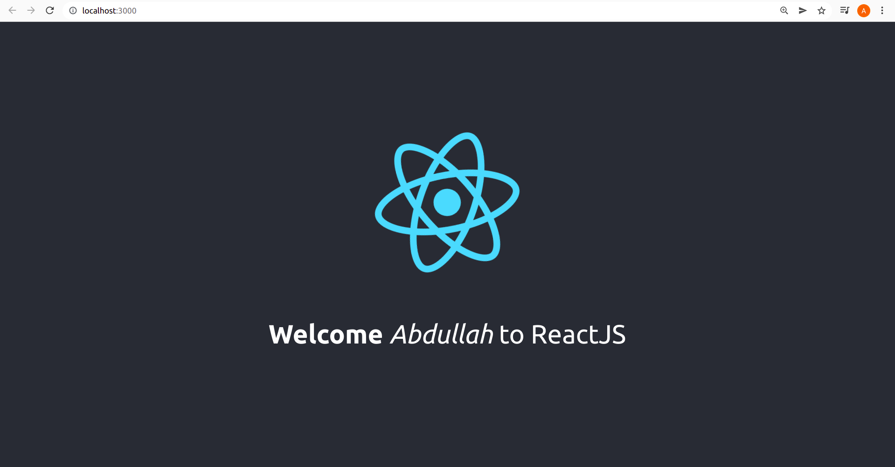
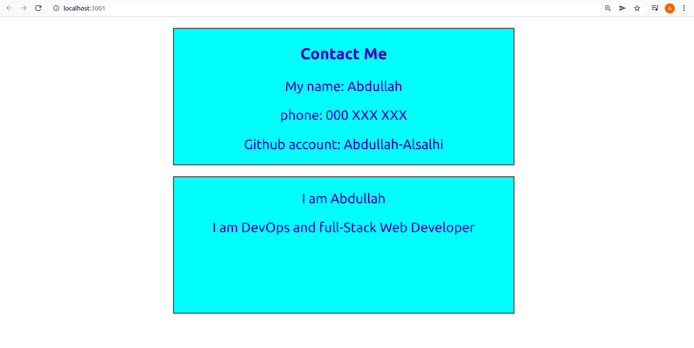

# Tuwaiq-JS

**Tuwaiq-Academey course of JavaScript programming language.**

## Introduction to ReactJs

1. create project using React 
```bash
npx create-react-app react-app
```
1. wait until it is ready :)
1. run the project using:
```bash
npm run start
```
1. eye-scan package.js & App.js
1. change the code in APP.js
1. create component with name About, Contact.
1. user these components inside App.js
1. change some commands to see what is happening.


### Welcome to React.





### Contact and About Component.


