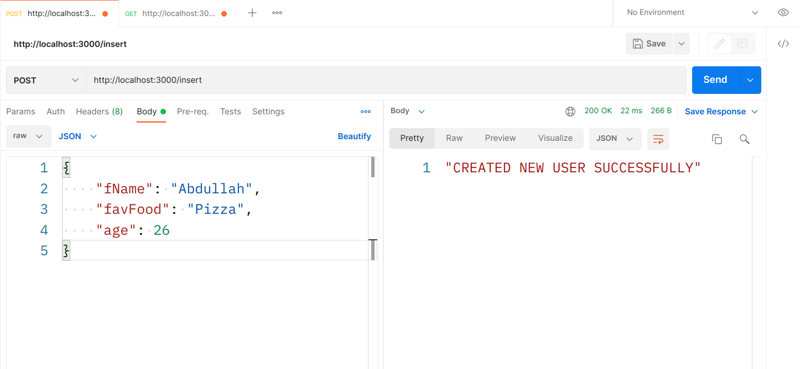
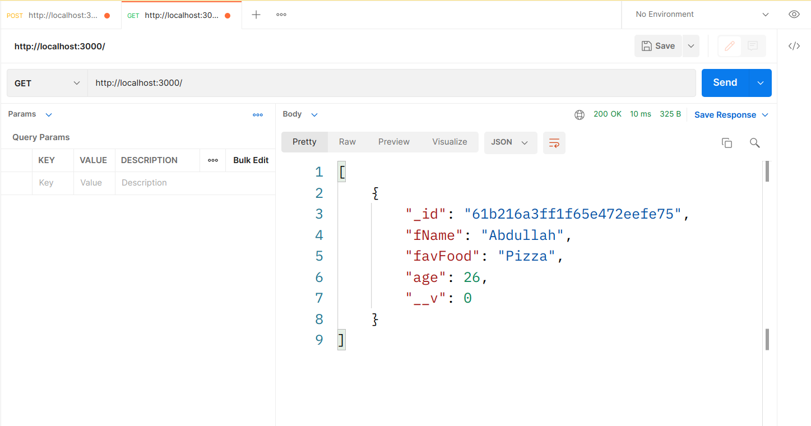
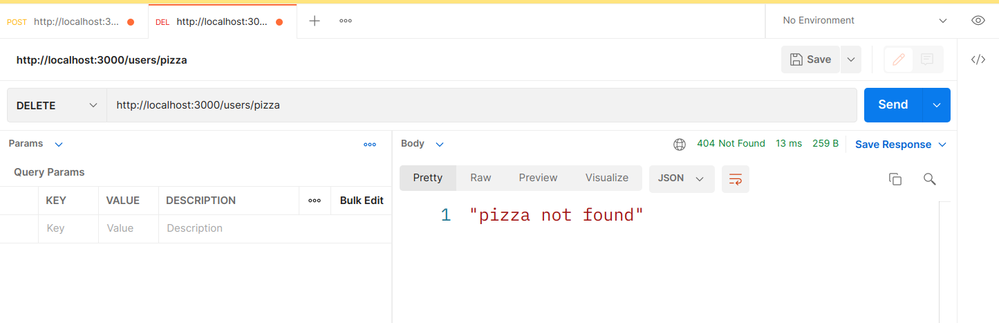
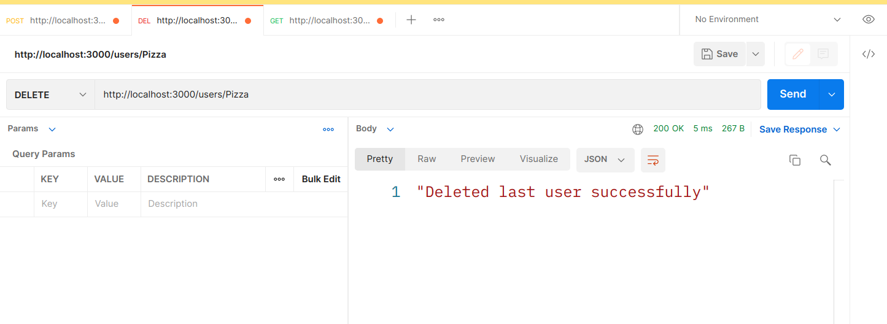
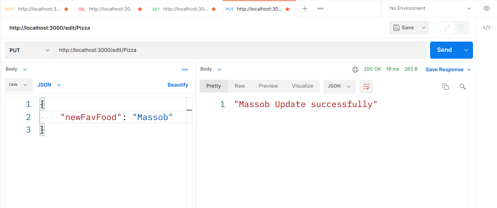

# Tuwaiq-JS

**Tuwaiq-Academey course of JavaScript programming language.**

## mongoose

## *Do the followings using database*

- initialize package.json and download express and mongoose
```bash
npm init
npm i express mongoose
```
- create app.js and db.js and make the connection of the database.
- write the commands to make server using mongoose.
- create Schema User within fName,favFood and age.
- create post function returns "created new user successfully".
- create get function returns all the data
- link app.js with db.js
---
### get request


### post request




### get request





## mongoose

## *Do the followings using database*

- ~~initialize package.json and download express and mongoose~~
```bash
npm init
npm i express mongoose
```
- ~~create app.js and db.js and make the connection of the database.~~
- ~~write the commands to make server using mongoose.~~
- ~~create Schema User within fName,favFood and age.~~
- ~~create post function returns "created new user successfully".~~
- ~~create get function returns all the data~~
- ~~link app.js with db.js~~
- create delete function returns "Deleted last user successfully"
- create put function returns "Update one user successfully"
- run the server using nodemon

### delete request





### delete request success





### delete request


### put request




