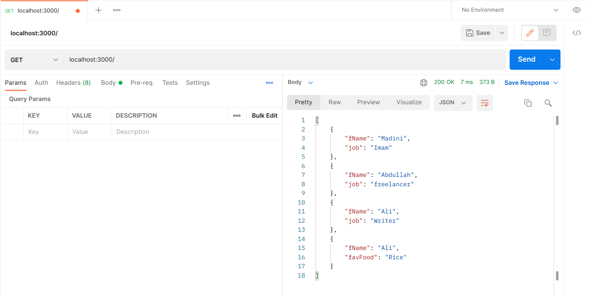
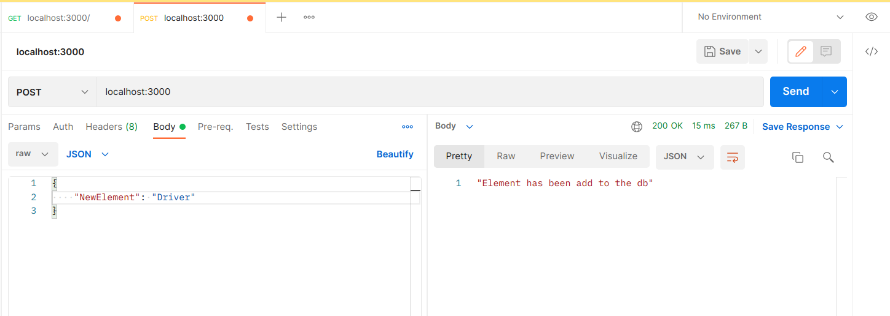
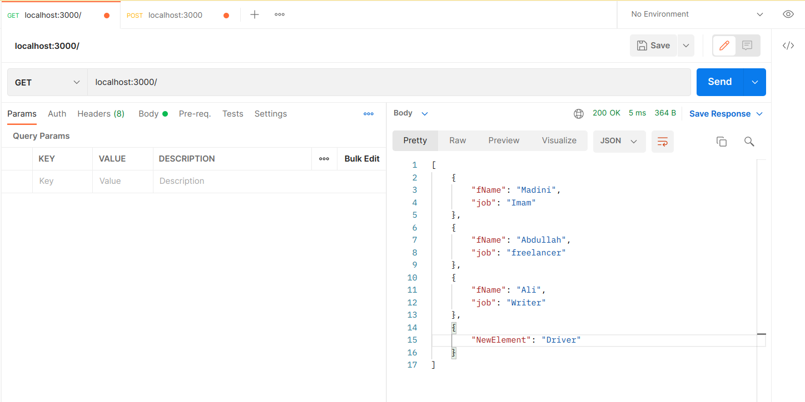
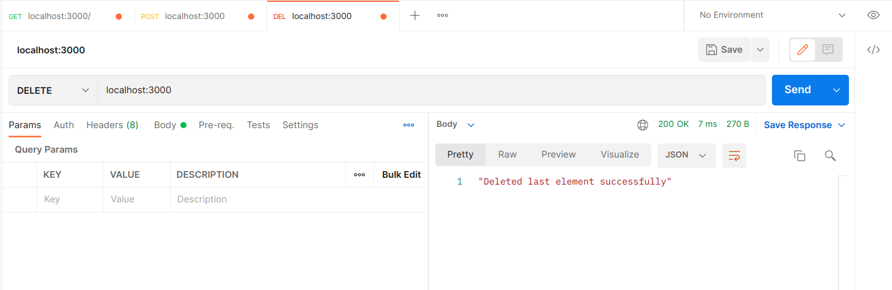
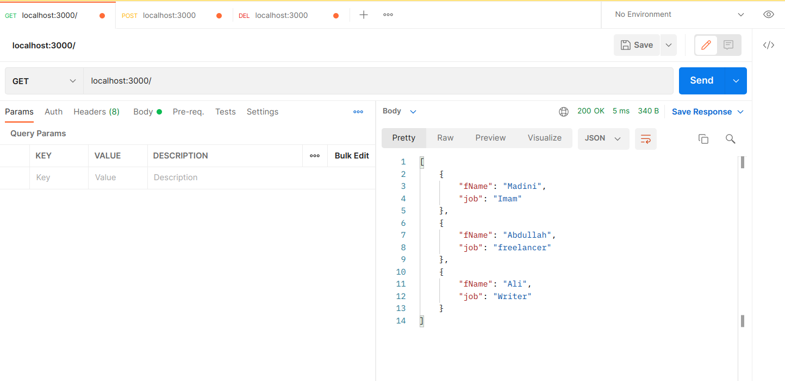
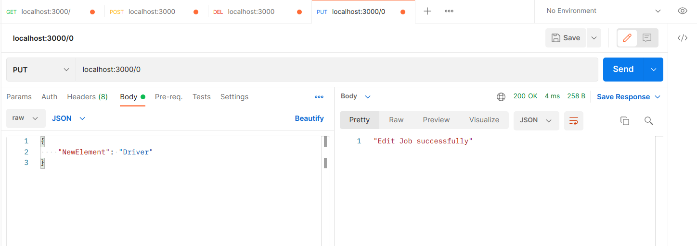
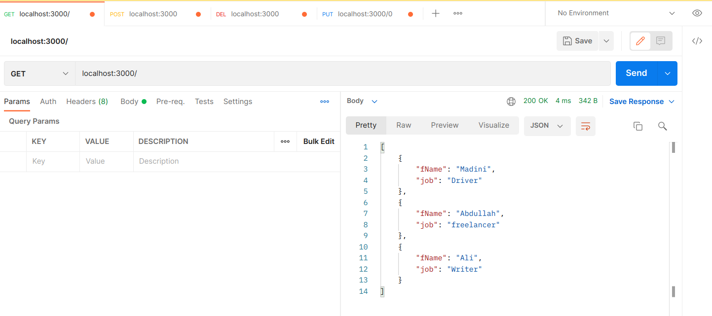

# Tuwaiq-JS

**Tuwaiq-Academey course of JavaScript programming language.**

## API
*Do the followings:*

- Install Express and verify it is downloaded and nodemon
```bash
sudo npm i -g nodemon
```
- create javascript file with name app.js
```bash
touch app.js
```
- write the basic commands to make a server using express
- create post function
- create listen function
- run the server using Node Js 
- test the function post using postman


**Post request**


**Get request**


*Do the followings:*

- ~~Install Express JS and verify and install nodemon~~
- ~~create javascript file called app.js~~
- ~~write the basic commands to make a server using express~~
- create put function
- create delete function
- run the server using Node JS
- test the functions of put and delete using postman


**Put request**


**Get request**


**Delete request**


**Get request**


## Homework

*create app.js and do the followings:*

- Install express and make sure it is installed and nodemon.
- Create javascript file called app.js
- Write the main commands to make server using express.
- Create get function returns all the data in an array.
- Create post function to add new element using body.
- Create put function to edit an element using params and body
- Create delete function to delete an element (*last element*)
- Create listen function
- Run the server using Node Js || nodemon
- Test all the functions using postman.

### **Get all**





### **Post**





### **Get all**





### **Delete all**





### **Get all**





### **Put all**





### **Get all**


