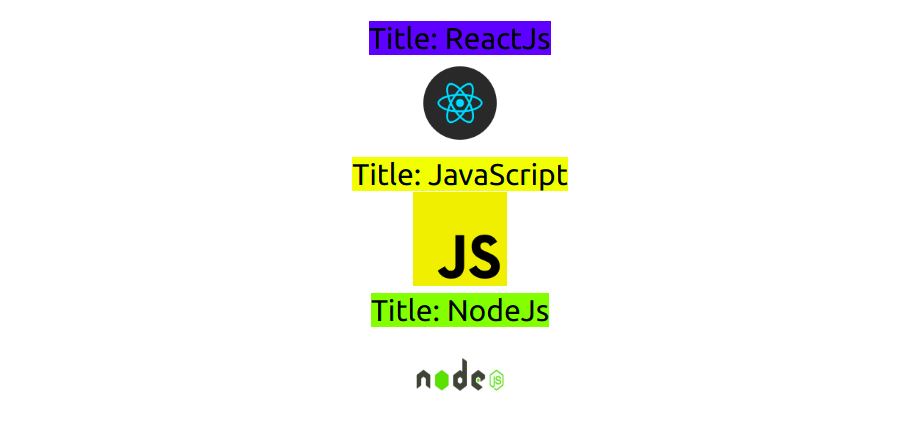

# Tuwaiq-JS

**Tuwaiq-Academey course of JavaScript programming language.**

## Introduction to ReactJs

1. create component with name Card.
1. Inside App.js use it 3 times.
1. pass props of obj: {title, img, color}
1. make the program dynamic.
1. use these props inside Card

# title img color

