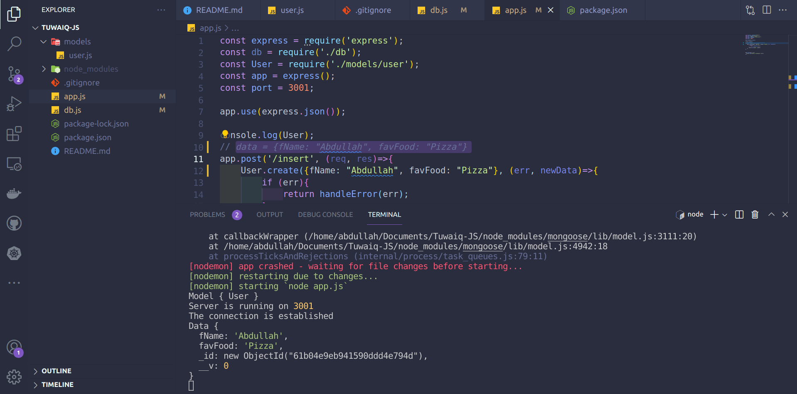
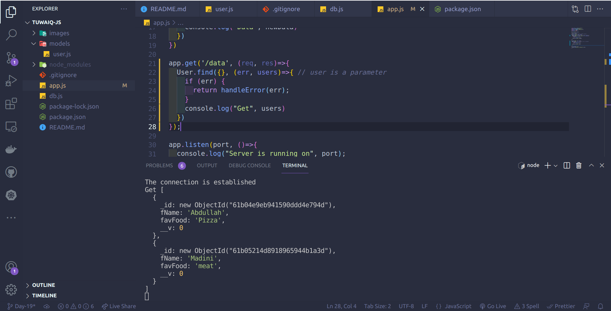

# Tuwaiq-JS

**Tuwaiq-Academey course of JavaScript programming language.**

## mongodb

_Do the followings:_

- Install MongoDB and run _npm i mongoose_ to install mongoose package.
- Create javascript file _app.js and db.js_.
- Write the main commands to make server using express.
- Link db.js with app.js and create listen function.
- Run the server using Node JS.
- Write the programming code to make connection with mongoDB

## Mongodb

_Do the followings:_

- ~~Link db.js with app.js and create listen function.~~
- Create Schema User within fName and favFood.
- Create post function that returns 'Created new user Successfully'.
- Create get function that returns the data stored in DB.
- Run the server using Node JS.

## Query Data from database:
**post request**

**get request**

]