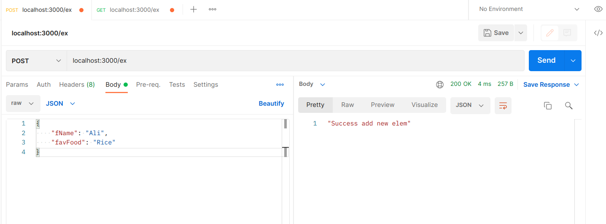
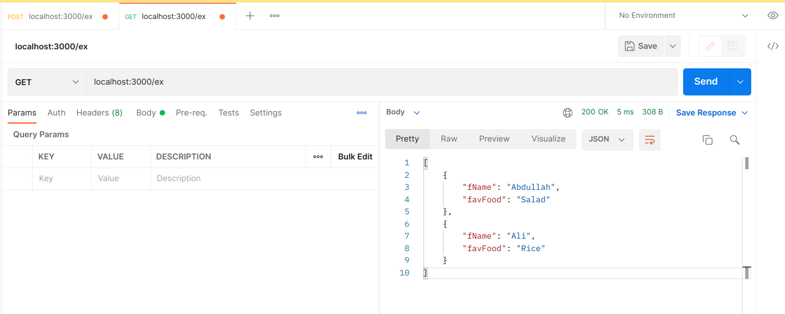

# Tuwaiq-JS

**Tuwaiq-Academey course of JavaScript programming language.**

## API
*Do the followings:*

- Install Express and verify it is downloaded and nodemon
```bash
sudo npm i -g nodemon
```
- create javascript file with name app.js
```bash
touch app.js
```
- write the basic commands to make a server using express
- create post function
- create listen function
- run the server using Node Js 
- test the function post using postman

**Post request**


**Get request**
